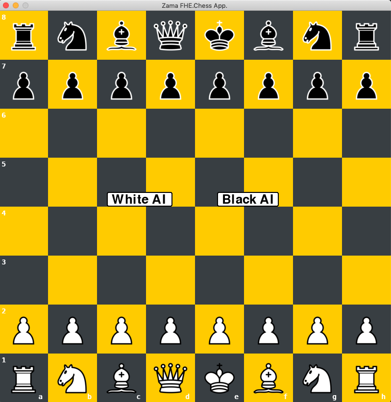
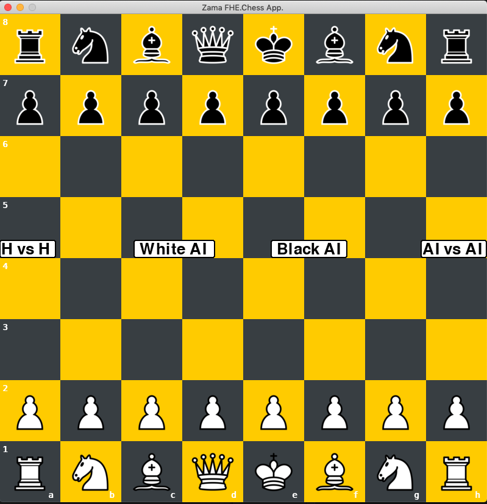

# FHE.Chess

## Overview
FHE.Chess is about an application that let you play Chess against an AI opponent. The moves are encrypted and then thanks to FHE, the AI infers on data that it cannot see.

<br>

## Acknowledgement
**This repo contains large files: training dataset.**<br>

-   FHE.Chess project answers to [Zama.ai](https://www.zama.ai)'s bounty and shows how to use Zama's [Concrete-ML](https://docs.zama.ai/concrete-ml/) open-source library,
-   The FHE.Chess app can be run under 3 modes:
    - clear: non-encryption context. Fast inferences.
    - simfhe: encrypted context thanks to simulation of FHE computations. Fast inferences.
    - deepfhe: encrypted context thanks to FHE. Very slow inferences (because model complexity + hardware)
-   AI mainly starts its moves the same way, after several white & black moves its moves are relevant,
-   Several minor bugs remain within the [Chess_app](docs/Chess_app/Chess_app.md) itself, such as:
    - potential false positive authorized en-passant moves,
    - because of the dual chess developments: one from scratch, one from python-chess, the latter call potential "illegal" moves (this does not lead to crash the app.).
- To download [wb_2000_300.csv](server_cloud/data/wb_2000_300.csv) training data, **[```git lfs```](https://git-lfs.com) is required**.

<br>

## How to
[Project flow](docs/Project_Flow.md) is the :o: **IMPORTANT** :o: document and represents your Ariadne's wire to install, run or rebuilt FHE.Chess project.<br>
As it contains details, explanations and links to other detailed docs, follow the inner steps it explains.
<br>

All documents are here [docs](docs).<br>
<br>

## Bibliography
All concept, benchmark modeling, code tutorial and libraries links are in [bibliography](docs/bibliography.md).<br>
<br>

## Set up and Play
As the app is based on a client-server architecture, client is at local, server at remote instance.<br>
(not to be confused with client-server architecture used when deploying models under the context of FHE).

<br>

**Local**
<br>
1.   ```mkdir client_local``` directory on your local machine (macOS, Linux, Windows),
2.   Create venv based on the [/requirements.txt](requirements.txt) file and activate venv,
3.   Download the content of ```client_local``` into your ```client_local``` local directory,
4.   ```cd client_local```
<br>

**Remote instance**
1.   Create a remote instance that runs under Intel Ice Lake CPU. Name of instance in GCI: "n2-standard-8", in AWS: EC2 "M6i",
2.   Run the remote instance and grab: public **IP_address** + **port** that enables to communicate with instance under firewall constrains (**for eg.: GCI, port 3389**),
3.   Create an SSH connection due to another terminal to command your remote instance. (if you don't know how, see [^1])<br>
4.   Create venv based on the [server_cloud/requirements.txt](server_cloud/requirements.txt) file and activate venv,
5.   ```mkdir fhechess``` directory,
6.   Download the content of ```server_cloud``` **_(without the mentioned large files)_** into ```fhechess``` directory.
7.   ```cd fhechess```.

At this step, you have 2 different terminals which are running simultaneously.<br>
Then, run:
<br>

**1st remote terminal**: ```$ python3 server/server_all.py -i (or --inference) "clear" or "simfhe" or "deepfhe"```<br>
!! Wait until the server is connected !! (waiting time:```"clear"``` and ```"deepfhe"``` < several seconds, ```"simfhe"``` between 2 and 7 mins)<br>

**2nd local terminal**: ```$ python3 client_local/chess_env/main.py --server "IP_address" --port PORT```<br>
NB:
- ```--server```: **Required option** and it enables "White AI" and "Black AI" modes,
If you have mistyped your IP_Address or if you forgot to run your remote server, please answer to the prompt displayed by your Local Terminal.
- ```--port```: **Facultative** if your value is the default value:```3389```. This is the ok firewall on GCI and AWS.
<br>

There is a "developer mode" called ```--devmode```. **Facultative** if you are not interesting in:
- "Human vs Human" game,
- "AI vs AI"game.<br><br>
Its default value: ```False```.<br>
To activate it, run ```$ python3 client_local/chess_env/main.py --devmode True --server "IP_address" --port PORT```
<br>

## Reset and kill
- to reset the game: press r,
- to kill: ctrl+C on local terminal or close the pygame window.
- in deepfhe mode, as it takes hours to predict (see. **mode** explanation [Project Flow](docs/Project_Flow.md)), kill the remote terminal.

<br>

## Playing FHE.Chess

2 main modes:

-   **Game** <br>
    <br>
    White or Black AI (vs Human as Black or White)<br>
    3 modes:
    - clear
    - simfhe
    - deepfhe
<br>
<div align="center"></div>
<br>

- **Developer Mode**<br>
    <br>
    2 more choices added to the Game mode:<br>
    - Human vs Human
    - AI vs AI (here to watch different type of behavior, you can play with the top best answers of each models. In your remote machine, then into [server_all.py](server_cloud/server/server_all.py), change the parameters 5 and 3 of <br>```python reply = inference.predict(data, 5, 3)```. Recall that 5 is the 5 top answers of Source model. And for each of them, Target model keep the 3 top answers).

<br>
<div align="center"></div>
<br>

[^1]: if needed, main steps to create ssh connection with GCI on Linux/Mac:
    -  recall your ```USERNAME``` from GCI and think about a ```KEY_FILENAME```,
    -  create your keys: run the command ```ssh-keygen -t rsa -f ~/.ssh/KEY_FILENAME -C USERNAME -b 2048``` (to see them ```ls .ssh```),
    -  then copy the private key (.pub is the public one)
    -  Add private key + ```USERNAME``` into your instance's metadata (follow this [process](https://cloud.google.com/compute/docs/connect/add-ssh-keys?hl=fr#add_ssh_keys_to_instance_metadata)),  
    -  ```cd .ssh```,
    -  established ssh connection with your instance, run ```ssh -i KEY_FILENAME USERNAME@IP_address```.
