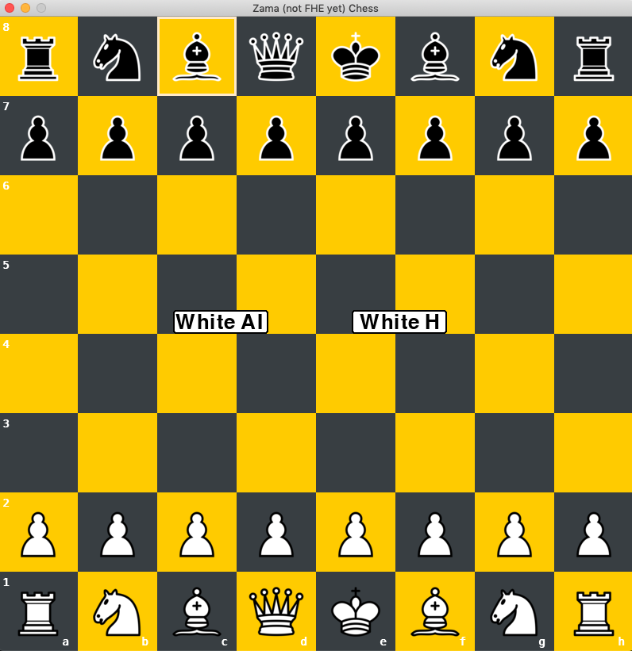

# FHE.Chess

## Overview
An application that plays Chess against an AI opponent. The moves are encrypted then thanks to FHE, the AI infers on data that she cannot see.

## Acknowledgement
**This repo contains large files: training dataset, mlir docs, keys and keys evaluations. All repo is about 8 Go.**
-   FHE.Chess project answers to [Zama.ai](https://www.zama.ai)'s bounty and shows how to use Zama's [Concrete-ML](https://docs.zama.ai/concrete-ml/) open-source library,
-   AI plays as "white" only,
-   The FHE.Chess app can be run under 3 modes:
    - clear: non-encryption context. Fast inferences.
    - simfhe: encrypted context thanks to simulation of FHE computations. Fast inferences.
    - deepfhe: encrypted context thanks to FHE. Extreme slow inferences (see. model complexity + hardware)
-   AI always starts her moves the same way, but from several white & black moves it starts to be very pleasant,
-   Several minor bugs remain within the Chess app. (see. "from scratch") itself, such as:
    -   false positive en-passant moves on sep,
    -   false positive move of kings even if the targeted square conducts to check
    Because of the dual chess developments: one from scratch, one from python-chess, the latter crashes the Chess app.
-   Do not download the followed large files directories:
    -   ```server_cloud/mlir_source.txt```
    -   ```server_cloud/mlir_target.txt```
    -   ```server_cloud/client/source```
    -   ```server_cloud/client/target```
    -   ```server_cloud/server/model```

## [Project flow](docs/Project_Flow.md)
Is the **IMPORTANT document** and represents your Ariadne's wire to install, run or rebuilt FHE.Chess project.
It contains details, explanations and links to other detailed docs.

## SET UP and PLAY
As the app is based on a client-server architecture, client is at local, server at remote instance.

<br/>

**Local**
<br/>
1.   ```mkdir client_local``` directory on your local machine (macOS, Linux, Windows),
2.   Create venv based on the ```[/requirements.txt](requirements.txt)``` file and activate venv,
3.   Download the content of ```client_local``` into your ```client_local``` local directory,
4.   ```cd client_local```
<br/>

**Remote instance**
1.   Create a remote instance that runs under Intel Ice Lake CPU. Google Cloud: "n2-standard-8" instance, AWS: EC2 "M6i" instance,
2.   Run the remote instance and grab: public **IP address** + **port** that enables to communicate with instance under firewall constrains (for Google Cloud: 3389),
3.   Create venv based on the [server_cloud/requirements.txt](server_cloud/requirements.txt) file and activate venv,
4.   ```mkdir fhechess``` directory,
5.   Download the content of ```server_cloud``` **_(without the mentioned large files)_** into ```fhechess``` directory.
6.   ```cd fhechess```.

At this step, you have 2 differents terminal which are running simultaneously.
7.   Run:
<br/>
local terminal : ```$ python3 client_local/chess_env/main.py --server _IP address_ --port _port_```
<br/>
remote terminal : ```$ python3 server/server_all.py -i (or --inference) _clear_, _simfhe_ or _deepfhe_```
<br/>

## Reset and kill
- to reset the game: press r,
- to kill, ctrl+C on local terminal or close the pygame window.
- in deepfhe mode, as it takes hours to predict (see. mode explanation [Project Flow](docs/Project_Flow.md)), kill the remote terminal.

<br/>

## FHE.Chess
<br/>
2 modes:

-   WhiteAI (AI as white vs Human as black)
-   White H (Human as white vs Human as black)
<br/>
<div align="center"></div>
