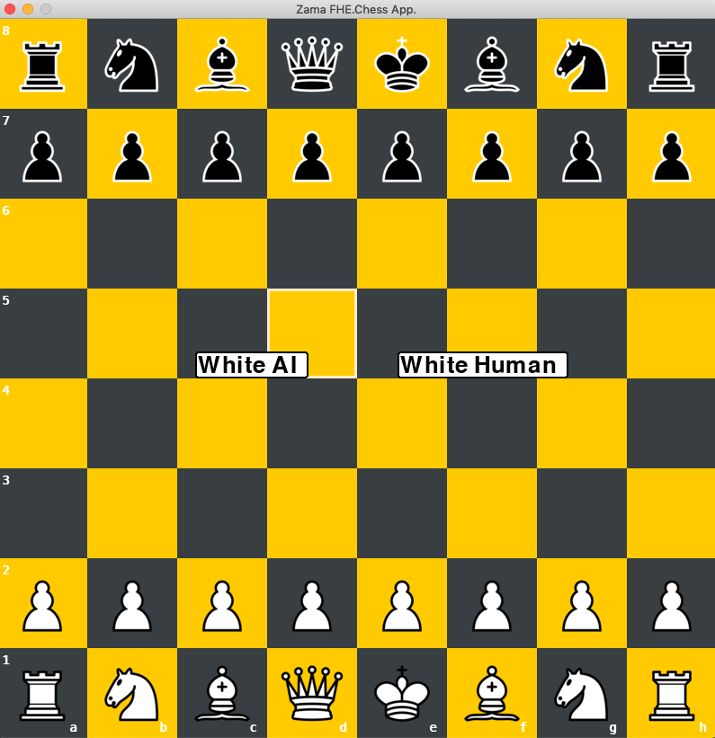

# FHE.Chess

## Overview
FHE.Chess is about an application that let you play Chess against an AI opponent. The moves are encrypted and then thanks to FHE, the AI infers on data that it cannot see.

<br>

## Acknowledgement
**This repo contains large files: training dataset, mlir docs, keys and keys evaluations. All repo is about 8 Go.**
-   FHE.Chess project answers to [Zama.ai](https://www.zama.ai)'s bounty and shows how to use Zama's [Concrete-ML](https://docs.zama.ai/concrete-ml/) open-source library,
-   AI plays as "white" only,
-   The FHE.Chess app can be run under 3 modes:
    - clear: non-encryption context. Fast inferences.
    - simfhe: encrypted context thanks to simulation of FHE computations. Fast inferences.
    - deepfhe: encrypted context thanks to FHE. Very slow inferences (because model complexity + hardware)
-   AI mainly starts its moves the same way, after several white & black moves its moves are relevant,
-   Several minor bugs remain within the [Chess_app](docs/Chess_app/Chess_app.md) itself, such as:
    -   false positive authorized en-passant moves,
    -   false positive authorized move of kings even if the targeted (aka destination) square conducts to check,
    Because of the dual chess developments: one from scratch, one from python-chess, the latter crashes the Chess app when a move is not "legal".
-   Do not download the followed large files directories:
    -   ```server_cloud/mlir_source.txt```
    -   ```server_cloud/mlir_target.txt```
    -   ```server_cloud/client/source```
    -   ```server_cloud/client/target```
    -   ```server_cloud/server/model```

<br>

## How to
[Project flow](docs/Project_Flow.md) is the **IMPORTANT** document and represents your Ariadne's wire to install, run or rebuilt FHE.Chess project.<br>
As it contains details, explanations and links to other detailed docs, follow the inner steps it explains.
<br>

All documents are here [docs](docs).<br>
<br>

## Bibliography
All concept, benchmark modeling, code tutorial and libraries links are in [bibliography](docs/bibliography.md).<br>
<br>

## Set up and Play
As the app is based on a client-server architecture, client is at local, server at remote instance.<br>
(not to be confused with client-server architecture used when deploying models under the context of FHE).

<br>

**Local**
<br>
1.   ```mkdir client_local``` directory on your local machine (macOS, Linux, Windows),
2.   Create venv based on the [/requirements.txt](requirements.txt) file and activate venv,
3.   Download the content of ```client_local``` into your ```client_local``` local directory,
4.   ```cd client_local```
<br>

**Remote instance**
1.   Create a remote instance that runs under Intel Ice Lake CPU. Name of instance in GCI: "n2-standard-8", in AWS: EC2 "M6i",
2.   Run the remote instance and grab: public **IP_address** + **port** that enables to communicate with instance under firewall constrains (**for eg.: GCI, port 3389**),
3.   Create an SSH connection due to another terminal to command your remote instance. (if you don't know, see the footnote: **NOTE**)<br>
4.   Create venv based on the [server_cloud/requirements.txt](server_cloud/requirements.txt) file and activate venv,
5.   ```mkdir fhechess``` directory,
6.   Download the content of ```server_cloud``` **_(without the mentioned large files)_** into ```fhechess``` directory.
7.   ```cd fhechess```.

At this step, you have 2 different terminals which are running simultaneously.<br>
Then, run:
<br>
local terminal : ```$ python3 client_local/chess_env/main.py --server IP_address --port 3389```
<br>
remote terminal : ```$ python3 server/server_all.py -i (or --inference) "clear" or "simfhe" or "deepfhe"```
<br>
<br>
## Reset and kill
- to reset the game: press r,
- to kill: ctrl+C on local terminal or close the pygame window.
- in deepfhe mode, as it takes hours to predict (see. **mode** explanation [Project Flow](docs/Project_Flow.md)), kill the remote terminal.

<br>

## Playing FHE.Chess

2 main modes:

-   WhiteAI (AI as white vs Human as black)<br>
    3 modes:
    - clear
    - simfhe
    - deepfhe
-   White H (Human as white vs Human as black)
<br>
<div align="center"></div>

<br>

> **_NOTE:_** if needed, main steps to create ssh connection with GCI:
-   generate private and public keys via your google cloud instance dashboard,
-   add KEY_VALUE USERNAME to your Google instance > TAB "Metadata" > TAB "SSH",
-   locate your keys into a local "ssh" folder  ```ssh-keygen -t rsa -f ~/.ssh/KEY_FILENAME -C USERNAME -b 2048```,
-   ```cd .ssh```,
-   established ssh connection with your instance, run ```ssh -i nameofkeys USERNAME@IP_address```.
