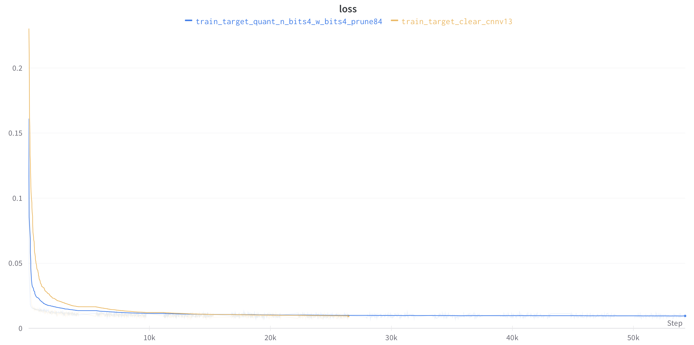
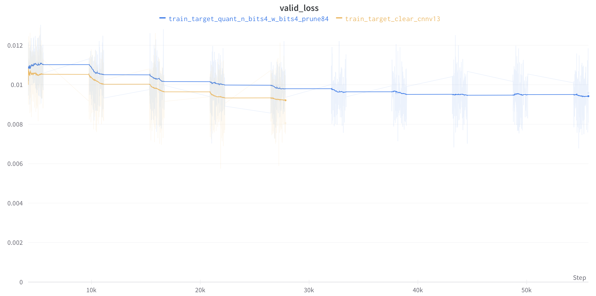
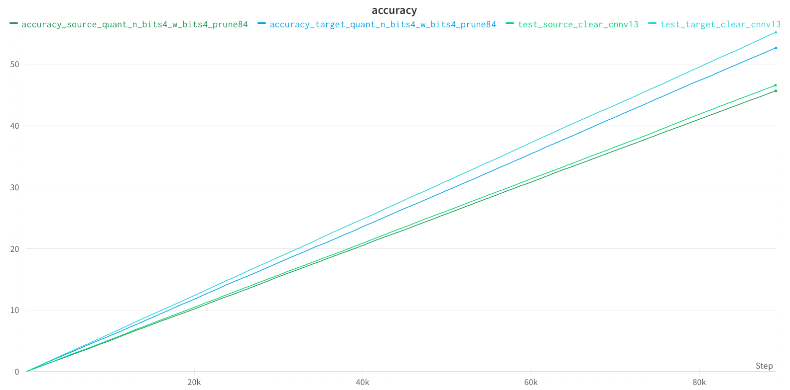

# Project Flow

## Overview

FHE.Chess is about an application that let you play Chess against an AI opponent. The moves are encrypted and then thanks to FHE, the AI infers on data that it cannot see.

## Description

Creation of a machine-learning-based version of a Chess player which can be executed in FHE, i.e., where the AI does not see the unencrypted moves.<br>
On the player (client) side, the board would be in clear; then, when it's the AI's turn, the app encrypts the board and sends it to the server, which then runs the machine-learning model inference over encrypted data, to predict a new (encrypted) move to apply.<br>
Finally, the app decrypts this move and applies it on the board, and reiterate the process until the game is over.

## Knowledge

*   [**Read Me**](../README.md) provides succinct information to run the FHE.Chess.

*   **Semantic**: while reading, you will faced to specific terms, let's clear them out.

    *   **Bitboard**: as a chessboard is made of 64 squares (8*8), one feature of a bitboard used here is to indicate the implicit square denomination and localization as the indices from an array of shape (64,). Concretely, square "0" is located at "a1" and square "63" is at "h8". Then, to describe, for eg.: a pawn's move "a2a4", it would be from source square: 8 to target square: 24. Other deeper uses are made from [Bitboards](https://www.chessprogramming.org/Bitboards).
    
    *   **Source**, **Target**: are respectively the selected square to move from and the selected square to move to.

    *   **Clear**: means non-encrypted in cryptography context.

    *   **[Quantization](https://docs.zama.ai/concrete-ml/advanced-topics/quantization)**: refers to techniques that helps to constrain an input from continuous (floating point precision) or large set of values to a discrete set (such as integers). Two main libraries are known - _Brevitas_ and _PyTorch_ - to quantize models.

    *   **[Compilation](https://docs.zama.ai/concrete-ml/advanced-topics/compilation#fhe-simulation)**: is handled by Zama's Concrete-ML library. It produces low-code which acts at each computation steps within the quantized models to execute dedicated computations on encrypted data. The price of these additional operations is a slowdown at inference step (see, "simfhe" vs "deepfhe" below) but the huge benefit is to provide equivalent accuracy rate to non-encrypted environment. The more complex is a quantized model the longer it takes to output a prediction.

    *   **FHE circuit**: stands for Full Homomorphic Encryption which enables to compute directly on encrypted input_data to infer encrypted output data.

    *   **[Concrete ML](https://docs.zama.ai/concrete-ml/)** is an open source, privacy-preserving, machine learning inference framework based on Fully        Homomorphic Encryption (FHE).

*   **3 modes enabled** in the FHE.Chess app.:

    *   "**clear**" - the AI uses non-encrypted inputs data (current chessboard and source) and infers non-encrypted output data (the move) due to models (non-quantized).

    *   "**simfhe**" - the AI uses a simulation context `fhe="simulate"` to infer encrypted output data (the move when decrypted) based on encrypted inputs data (current chessboard and source) and thanks to quantized and compiled models.

    *   "**deepfhe**" - the AI uses the quintessence of FHE to infer encrypted output data (the move when decrypted) based on encrypted inputs data (current chessboard and source square) and thanks to quantized and compiled models.

    *   "simfhe" vs "deepfhe"

        *   the latter needs to save and deployed the models into dedicated client-server architecture. Which includes generated keys to encrypt data (client's job) and keys_evaluation to infer on encrypted data (server's job). "simfhe" simulates the said process.

        *   based on current models complexities and hardware capacity (Ice Lake CPU), unlike "simfhe" which provides an answer within a second (like "clear"), "deepfhe" takes hours to infer.

        *   both needs to have compiled models (already quantized).

        *   NB: if you test "deepfhe", you will want to kill the remote server as you will feel that the FHE.Chess "spins forever" as it waits the inferred move by the AI.
<br/>

## Architecture Client-Server

*   **current architecture**: because of local machine's OS constraint and complexity of model, see. "deepfhe" mode.<br>
Here both client-server FHE are on remote server. Basically, the chess app (scripts which runs the chessboard, pieces, movements rules, ...) itself is in `client_local`.<br>
Then, compilation, computation and inference on encrypted data are made in remote server (instance).
<br/>
<div align="center"></div>

<br/>

*   **future architecture**:<br>
Here, client FHE is on local and server FHE on remote server. The chess app itself is still in `client_local` accompanied with client FHE (to encrypt input_data). Then, computations on encrypted input_data and inference of encrypted output data are made in remote server (instance).
<br/>
<div align="center"></div>

<br/>

## Dependencies installation

_creation and activation of virtual environments are strongly recommended._
<br/>

on your local machine, run `pip install --no-cache-dir -r requirements.txt` inside `client_local` directory.
[/requirements](../requirements.txt)
```text
chess==1.9.4
numpy==1.23.5
pygame==2.1.2
python >=3.8.1
```
<br/>

on remote machine, run `pip install --no-cache-dir -r requirements.txt` inside `server_cloud` directory.
[server_cloud/requirements](../server_cloud/requirements.txt)
```text
brevitas==0.8.0
chess==1.9.4
concrete-ml==1.0.3
numpy==1.23.5
pygame==2.1.2
python >=3.8.1
torch==1.13.1
tqdm==4.64.1
wandb==0.13.10
```

<br/>

## Problematic
### AI
At the core of this project is the question: what structure would have the AI? <br>

Because we didn't want to reinvent the wheel (see well known chess engines: [Stockfish](https://stockfishchess.org) < [AlphaZero](https://arxiv.org/abs/1712.01815) < [LCZero (LeelaChessZero)](https://lczero.org))[^1] but saving money and time, a straight forward solution came up thanks to the [B. Oshri and N. Khandwala paper](http://vision.stanford.edu/teaching/cs231n/reports/2015/pdfs/ConvChess.pdf) and rationalization.

What are the indispensable points?
- the environment is a chessboard of 64 (8*8) squares, 6 types of pieces, handled by 2 opponents,
- each type of piece has an importance/value,
- each type of piece obeys to its own rule of movement (correlated with their importance),
- chess is about taking a several dimension of decisions. Based on a current context (localization of all the white and black pieces on the chessboard) and an assessment of multiple future contexts, player "white", for example, decides to select a piece from a "Source" location to a "Target" destination,
- each square of the chessboard has a value based on each piece type. (see [Piece Square Table](https://www.chessprogramming.org/Simplified_Evaluation_Function)),
- human applies specific technics or methods which would be looking for a "bad" bishop, play the "Spanish opening" or the "Sicilian defense", ...

As human has already integrated all these points, each move made by players with high rating ELO is a (spatial and time) optimization of a merge of all those points.<br>
The [Predicting Moves in Chess using Convolutional Neural Networks](http://vision.stanford.edu/teaching/cs231n/reports/2015/pdfs/ConvChess.pdf) of B. Oshri and N. Khandwal, let us already know that relevant patterns appear on recurrent context of attack and defense.<br>

Thus, **the approach** would be:
- The AI will be building on 2 deep learning models (see [Model Lifecycle doc](model_lifecycle.md)):
    - 1 to select the square where is located the piece we would like to move,
    - and only 1 to select the square of destination where the piece would move to,
- the inferred move would be filtered as ```legal_move``` by Python-Chess library's method, and then applied in the chess game environment (see [Chess_app](/docs/Chess_app/)).
- Like, B. Oshri and N. Khandwal, the rules of game and the evaluation function are not part of the input_data.

[^1]: the probability tree from a "Source"/"Target" couple is very large. <br>
The exploration of branches:
    - all branches tackled by [Alpha-Beta pruning](https://www.chessprogramming.org/Alpha-Beta) with a limited depth in the tree used by Stockfish,
    - some of them but until the very end of the game like Alpha-zero with [MCTS](https://web.archive.org/web/20180623055344/http://mcts.ai/about/index.html)
is what it takes to build a robust chess engine.

### FHE
Which data will be encrypted and use for computations?<br>
(see [Model Lifecycle doc](model_lifecycle.md))<br>
- Model 1:
    - input_data: layers for each piece type within a chessboard (spatial indication of piece's location),
    - output_data: the selected square of departure.
- Model 2:
    - input_data: layers for each piece type within a chessboard (spatial indication of piece's location) + Model 1's output,
    - output_data: the selected square of destination.

In terms of architecture, at deployment, it is necessary to base the application on the client-server canvas (see. [model_deploy_FHE](model_deploy_FHE.md)). <br>
- client: takes care of input_data encryption and decryption (thanks to private keys),
- server: takes care of the necessary computations to predict (thanks to public key).

<br>

## Data management

Raw data are downloadable here: [kaggle.com/datasets/arevel](https://www.kaggle.com/datasets/arevel/chess-games)

*   **Raw data**: quick explanation via [data Explanation](data_explanation.md),

*   **Data preparation**: is explained in this [wb_2000](https://github.com/vrona/FHE.Chess/blob/quant_fhe/server_cloud/data/wb_2000.ipynb) notebook.<br>
Little take away: the goal is to create an AI that would be rated at least 1500 ELO on Lichess.<br>
Thus, the preparation step aimed to provide only data points derived from games of chess players rated at least 2000 ELO each (white and black).

*   **Data transformation**: transformations are supplied by [helper_chessset.py](https://github.com/vrona/FHE.Chess/blob/quant_fhe/server_cloud/model_src/helper_chessset.py) for training and production. However, for compilation, [data_compliance.py](../server_cloud/server/data_compliance.py) is solicited.<br>
All details are here: [data transformation](data_transformation.md).

<br>

## Chess App.

The AI needs an environment to take input from and to apply its output.<br>
The development of the chess app itself can be done completely from scratch or based on [python-chess](https://python-chess.readthedocs.io/en/latest/) library.<br>
It happens that this project is based on both (to speed up development).<br>

Except the [Clone_Chess class](https://github.com/vrona/FHE.Chess/blob/quant_fhe/client_local/chess_env/clone_chess.py) which returns [python-chess](https://python-chess.readthedocs.io/en/) methods, everything from [client_local/chess_env](https://github.com/vrona/FHE.Chess/tree/quant_fhe/client_local/chess_env) is made from scratch.<br>

Explanations of chess app scripts are here: [Chess_app](Chess_app/Chess_app.md).

<br>

## Models lifecycle

The dedicated document to read is: [Models lifecycle](model_lifecycle.md).<br>

Sum-up, 2 models in 2 contexts:

*   **clear** (PyTorch)

    *   **[Source model](../server_cloud/model_src/clear/cnn_source_clear.py)**

        *   input source : (12,8,8) board -> output source : selected Square number to move from as 1D array of shape (64,)

        *   4 convolution layers (hidden size=128) + fully-connected layer (64)

    *   **[Target model](../server_cloud/model_src/clear/cnn_target_clear.py)**

        *   input_target : (12,8,8) board + Source model's output (selected Square number to move from) as 1D array of shape (64,) -> output target : selected Square number to move TO as 1D array of shape (64,)

        *   4 convolution layers (hidden size=128) + 2 fully-connected layer (64)

*   **quantized** (Brevitas - PyTorch)

    *   **[Source model](../server_cloud/model_src/quantz/source_44cnn_quantz.py)**

        *   input source : (12,8,8) board -> output source : selected Square number to move FROM as 1D array of shape (64,)

        *   4 convolution layers (hidden size=128) + fully-connected layer (64)

    *   **[Target model](../server_cloud/model_src/quantz/target_44cnn_quantz.py)**

        *   input_target : (12,8,8) board + Source model's output (selected Square number to move from) as 1D array of shape (64,) -> output target : selected Square number to move TO as 1D array of shape (64,)

        *   4 convolution layers (hidden size=128) + 2 fully-connected layer (64)

        *   **IMPORTANT at inference** target model diverges. Code [target model eval](../server_cloud/model_src/quantz/target_44cnn_quantz_eval.py).

*   **Results monitoring**

    *   Source:

        *  Training and Validation losses<br>

        <div align="center"></div><br>
        
        <div align="center"></div><br>


    *   Target:
        
        *  Training and Validation losses<br>

        <div align="center"></div><br>
        
        <div align="center"></div><br>


    *  Accuracy for all 4 models <br>

        <div align="center"></div><br>


## Compilation / Simulation / Deployment (FHE client-server)


## Set up and play

As the app is based on a client-server architecture, client is at local, server at remote instance.

<br/>

**Local**
<br/>
1.   ```mkdir client_local``` directory on your local machine (macOS, Linux, Windows),
2.   Create venv based on the [/requirements.txt](requirements.txt) file and activate venv,
3.   Download the content of ```client_local``` into your ```client_local``` local directory,
4.   ```cd client_local```
<br/>

**Remote instance**
1.   Create a remote instance that runs under Intel Ice Lake CPU. GCI (Google Cloud Instance): "n2-standard-8" instance, AWS: EC2 "M6i" instance,
2.   Run the remote instance and grab: public **IP address** + **port** that enables to communicate with instance under firewall constrains (**for eg.: GCI, port 3389**),
3.   Create an SSH connection due to another terminal to command your remote instance. (if you don't know, see the **NOTE** at the bottom)<br/>
4.   Create venv based on the [server_cloud/requirements.txt](server_cloud/requirements.txt) file and activate venv,
5.   ```mkdir fhechess``` directory,
6.   Download the content of ```server_cloud``` **_(without the mentioned large files)_** into ```fhechess``` directory.
7.   ```cd fhechess```.

At this step, you have 2 differents terminal which are running simultaneously.<br/>
Then, run:
<br/>
local terminal : ```$ python3 client_local/chess_env/main.py --server IP address --port 3389```
<br/>
remote terminal : ```$ python3 server/server_all.py -i (or --inference) clear or simfhe or deepfhe```
<br/>

## Reset and kill
- to reset the game: press r,
- to kill, ctrl+C on local terminal or close the pygame window.
- in deepfhe mode, as it takes hours to predict (see. mode explanation [Project Flow](docs/Project_Flow.md)), kill the remote terminal.

<br/>
